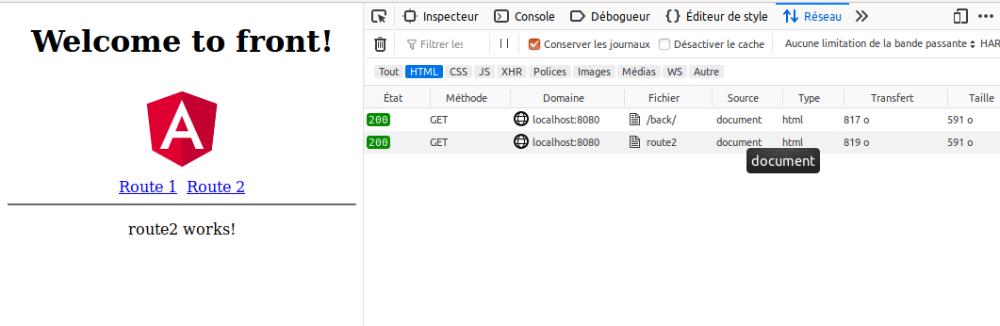

https://angular.io/guide/deployment#routed-apps-must-fallback-to-indexhtml

```
If the app uses the Angular router, you must configure the server to return the application's host page (index.html) when asked for a file that it does not have.

A routed application should support "deep links". A deep link is a URL that specifies a path to a component inside the app. For example, http://www.mysite.com/heroes/42 is a deep link to the hero detail page that displays the hero with id: 42.

There is no issue when the user navigates to that URL from within a running client. The Angular router interprets the URL and routes to that page and hero.

But clicking a link in an email, entering it in the browser address bar, or merely refreshing the browser while on the hero detail page — all of these actions are handled by the browser itself, outside the running application. The browser makes a direct request to the server for that URL, bypassing the router.
```

# install
jee-angular-server-routes/front>npm install

# build
jee-angular-server-routes>mvn clean package

# run
cp jee-angular-server-routes/back/target/back.war .../apache-tomcat-8.0.36/webapps

